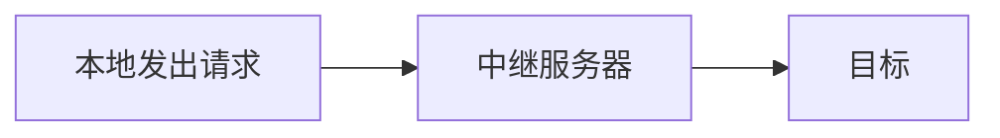

# 说明

本项目启发于一位18级学长,在他的思想上实现并改进

实现:
 - 解除晚上断网限制(用校园VPN也可以解决)
 - 没有充值校园网也可以在宿舍免费上网

# 学校网络环境简单说明

"BNUZ"和"BNUZ-Student"这两个网络是学校的内网,拥有学校内网IP的服务器,我们可以直接访问

以木铎为例,在木铎实验室或者办公室中,插入网线,在浏览器输入"rz.bnuz.edu.cn"完成认证即可上网(或者手动配置IP),这样,你可以使用一些命令查看当前电脑的IP(如果你手动配置了IP那该IP就是你电脑的IP).这样我们可以在任何连接了"BNUZ"或者"BNUZ-Student"网络的地方访问到你的电脑,无需校园网认证,这是本项目成立的前提

# 教程
## 科学上网原理简介

GFW(墙)会阻隔我们和墙外目标服务器的连接,所以我们找到中间的没有被墙的服务器(中继服务器)来帮我们访问,这就叫代理

## 根据科学上网原理形成的代理方案

断网后还可以访问学校内网的网站,那么我们可以在教学楼或者实验室买一个小型的服务器(树莓派或者各种矿渣产品,我是用玩客云刷机成的Debian,系统建议Linux),确保晚上不会断电,然后我们可以用这个服务器手动配置好IP(如果有路由器的需要端口映射)设置代理,即让我的电脑所有的访问先全部通过内网访问到这个服务器,然后由服务器再发出请求到外网,然后接收信息再返回我的电脑

### 服务器设置代理

记得需要内网IP+端口能访问到服务器

个人使用的一键搭建脚本就是[这个](ssrmu.sh),在Linux上执行`bash ssrmu.sh`即可,大部分上默认就行,结束之后会输出信息,先复制下来,后面要用

### 客户端

我们在电脑或者手机上需要有相应的软件来进行代理,常见的有`ShadowsocksR`,`Clash`,`V2Ray`等

PC端以`ShadowsocksR`举例,打开之后按照设置一个一个填入代理完成后的信息(或者使用二维码,剪贴板的方式导入),然后开启**全局模式**即可

这样每次断网之后连接校园网打开该服务就能上网了,交了网费的断网后还能接着上网,没交网费的可以天天开着24小时上网

### 配置文件前置代理[可选]

作为计算机专业的学生无法上外网是不是很麻烦?

于是我想着,在clash订阅链接加一个前置代理不就完了?

[clash文档](https://github.com/Dreamacro/clash/wiki)

#### clash配置文件增加前置代理

参考以下:
 - https://github.com/Dreamacro/clash/issues/434
 - https://github.com/Fndroid/clash_for_windows_pkg/issues/3366
 - https://github.com/Fndroid/clash_for_windows_pkg/issues/1632
 - https://github.com/Fndroid/clash_for_windows_pkg/issues/882
 - https://github.com/Dreamacro/clash/pull/539

加入ssr节点之后,我们需要新增一个代理组`⏭ relay`

假设你原来所有国外流量的都走`✅ select`,那么设置一个新的组`⏭ relay`,将`type`设置为`relay`,在`proxies`选项中第一个添加你的中继节点服务器(我的就是教学楼的服务器了,例子则是`🇯🇵 JP`),第二个即为你原来的proxy,例子中是`✅ select`,这样开全局的时候选择`⏭ relay`组就可以了

